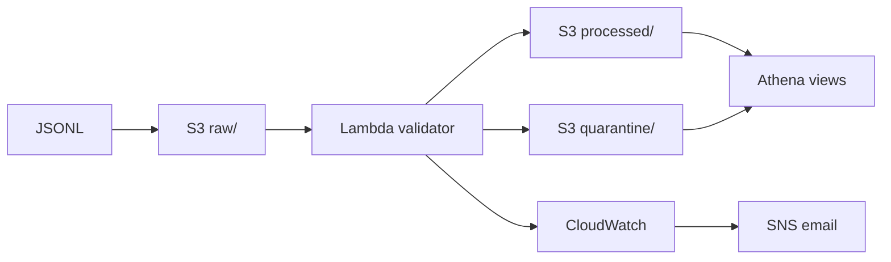

# AWS RetailOps Governed Data Pipeline

An event-driven AWS data-quality pipeline...
# AWS RetailOps Governed Data Pipeline

An event-driven AWS data-quality pipeline that validates synthetic retail
transactions, separates accepted and quarantined records, exposes governed
Athena analytics, and alerts operators when processing fails.
# AWS RetailOps Governed Data Pipeline

[](https://github.com/eswarkumar-code/aws-retailops-governed-data-pipeline/actions/workflows/ci.yml)

An event-driven AWS data-quality pipeline...

## What this demonstrates

- Serverless ingestion with Amazon S3 and AWS Lambda
- Explicit schema validation and quarantine workflows
- Least-privilege IAM permissions
- Athena external tables, deduplication, data-quality metrics, and business KPIs
- CloudWatch logs, bounded retention, alarms, and SNS email notifications
- Reproducible infrastructure using AWS SAM/CloudFormation

## Architecture



## Validated results

Two synthetic 12-record batches were processed during the implementation:

| Metric | Result |
|---|---:|
| Valid records per batch | 8 |
| Invalid records per batch | 4 |
| Acceptance rate | 66.67% |
| Deduplicated transactions | 8 |
| Stores represented | 6 |
| Units sold | 14 |
| Gross sales | $94.18 |
| Discounts | $7.50 |
| Net sales | $86.68 |

The quarantine taxonomy detected missing identifiers, invalid quantities,
unsupported payment methods, and unexpected fields. The monitoring test also
verified the complete `Lambda failure → CloudWatch alarm → SNS → email` chain.

## Repository layout

```text
src/                 Lambda validation and enrichment code
tests/               Unit tests for validation and calculations
sample-data/         Synthetic JSONL input
sql/                 Athena tables, views, and analysis queries
iam/                 Least-privilege policy example
docs/                Architecture and operational notes
template.yaml        AWS SAM infrastructure template
```

## Local validation

```bash
python3 -m venv .venv
source .venv/bin/activate
pip install -r requirements-dev.txt boto3
pytest -q
```

## Deployment

The template creates a new private, versioned S3 bucket, Lambda function, S3
trigger, SNS topic, and CloudWatch error alarm.

```bash
sam build
sam deploy --guided
```

After deployment, confirm the SNS email subscription and configure Athena's
query-result location. Replace `REPLACE_WITH_BUCKET_NAME` in the SQL files with
the deployed bucket name before running them.

## Security and cost notes

- Never commit AWS credentials, account IDs, private URLs, or real customer data.
- Keep S3 Block Public Access enabled.
- The included template is educational; review IAM and retention policies before production use.
- Athena charges by bytes scanned, so use selected columns and bounded datasets.
- Delete or retain resources intentionally after testing to avoid unnecessary charges.

## Data disclaimer

All records are synthetic. This project does not contain real customer,
payment, loyalty, or store data. See [DATA_NOTICE.md](DATA_NOTICE.md).

## License

MIT

