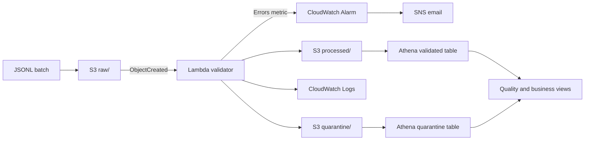

# Architecture

## Governance controls

- Private S3 bucket with public access blocked, ACLs disabled, versioning, and SSE-S3.
- Event filter restricted to `raw/*.jsonl` to prevent recursive invocation.
- Lambda role limited to reading `raw/` and writing `processed/` and `quarantine/`.
- Unexpected fields are rejected to expose schema drift and possible sensitive-data leakage.
- CloudWatch logs retain operational summaries rather than record payloads.
- Alarm threshold is one or more Lambda errors in five minutes; missing data is healthy.

